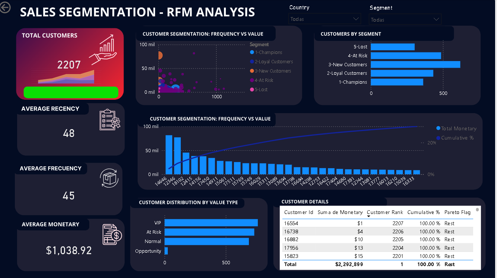

📊 Customer Segmentation (RFM Analysis)

📌 Business Context
This project analyzes customer behavior using RFM methodology to identify high-value customers and detect churn risk.

🎯 Objective
Segment customers based on Recency, Frequency, and Monetary value to support data-driven marketing and retention strategies.

🧾 Dataset
Customer-level dataset including:
- Recency (days since last purchase)
- Frequency (number of transactions)
- Monetary (total revenue per customer)

⚙️ Process
- Data preparation and transformation in Power BI
- Calculation of RFM metrics
- Scoring customers using percentile-based segmentation
- Creation of customer segments:
  - Champions
  - Loyal Customers
  - New Customers
  - At Risk
  - Lost
- Integration of Pareto analysis

📈 Analysis
- Customer distribution by segment
- Revenue contribution by segment
- Frequency vs Monetary behavior
- Customer ranking and cumulative revenue
- Identification of high-value and at-risk customers

💡 Key Insights
- Top 20% of customers generate approximately 70% of total revenue
- "Champions" segment shows the highest purchase frequency and value
- A large portion of customers falls into "At Risk" and "Lost" segments
- Customer behavior is highly uneven, indicating strong segmentation opportunities

🎯 Recommendations
- Prioritize retention strategies for Champions and Loyal Customers
- Develop reactivation campaigns for At Risk customers
- Improve onboarding and engagement for New Customers
- Monitor churn signals using Recency trends
