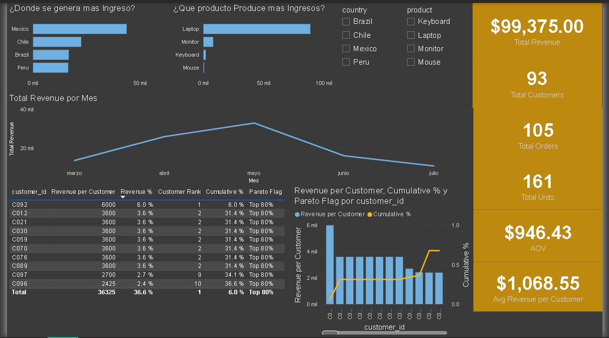

📊 Sales Performance & Customer Concentration Analysis

📌 Business Context
This project simulates a retail sales environment to analyze revenue distribution, customer behavior, and dependency on key customers.

🎯 Objective
Identify where revenue is generated, which products drive sales, and how concentrated revenue is among customers.

🧾 Dataset
Transactional sales data including:
- Customer ID
- Country
- Product
- Revenue
- Orders and units

⚙️ Process
- Data cleaning and transformation using Power Query
- Creation of measures in Power BI:
  - Total Revenue
  - Total Orders
  - Average Order Value (AOV)
  - Revenue per Customer
- Customer ranking and Pareto analysis (80/20 rule)

📈 Analysis
- Revenue by country
- Revenue by product
- Monthly revenue trends
- Top customers by revenue
- Pareto distribution (cumulative revenue %)

💡 Key Insights
- Top customers generate a significant share of total revenue (~70%)
- Revenue is highly concentrated in a small group of customers
- Laptop category dominates overall revenue
- Sales peaked in May and declined afterwards

🎯 Recommendations
- Focus on retention strategies for top customers
- Reduce dependency risk by expanding the customer base
- Strengthen sales strategies for high-performing products
- Investigate the drop in revenue after peak months
